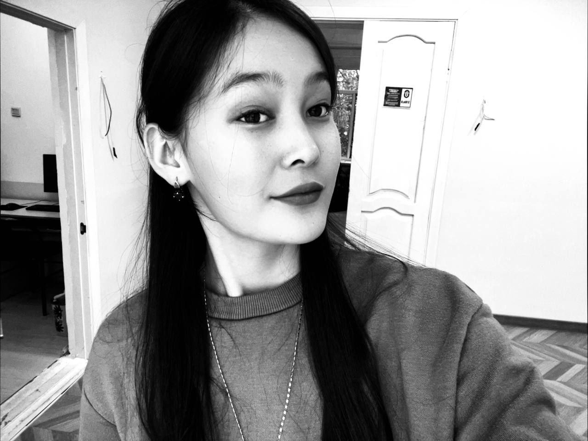
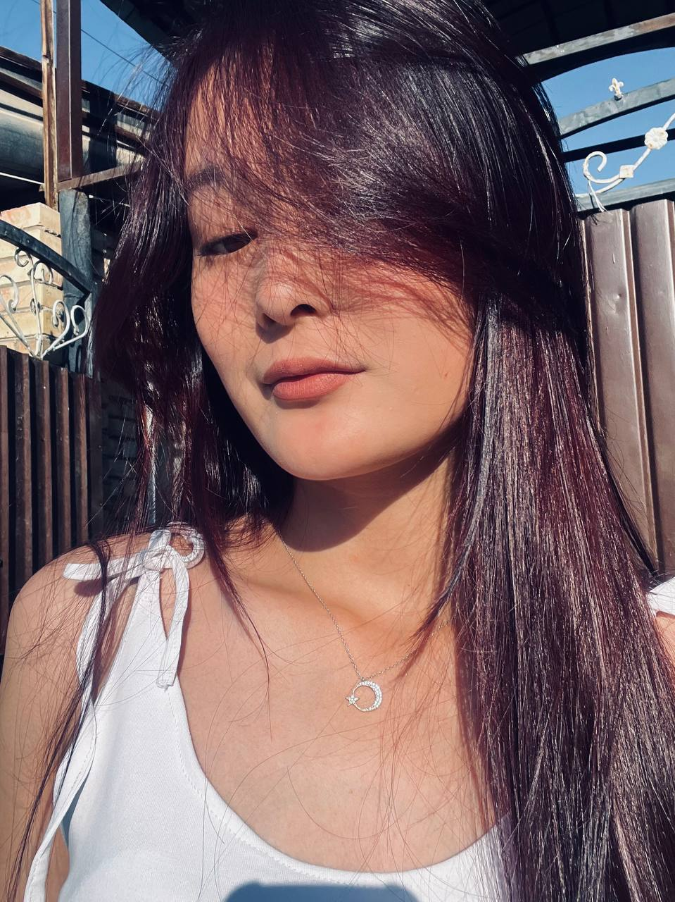
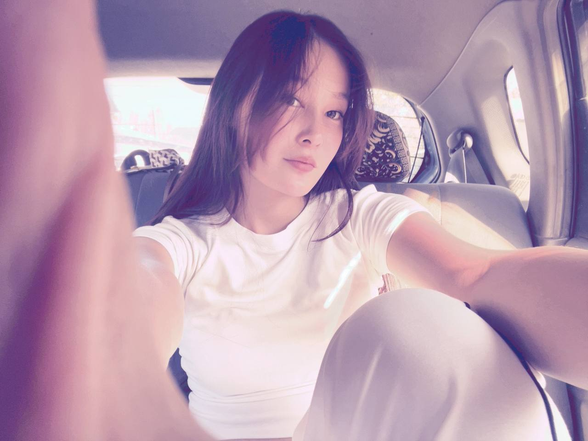
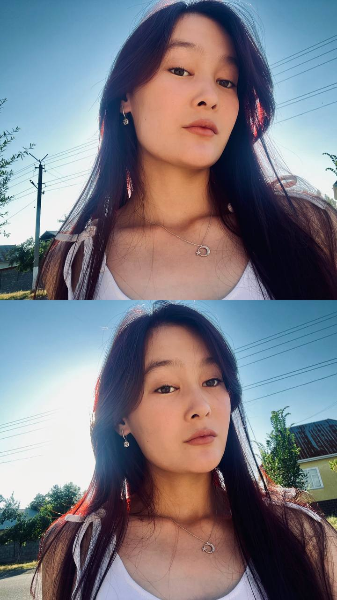
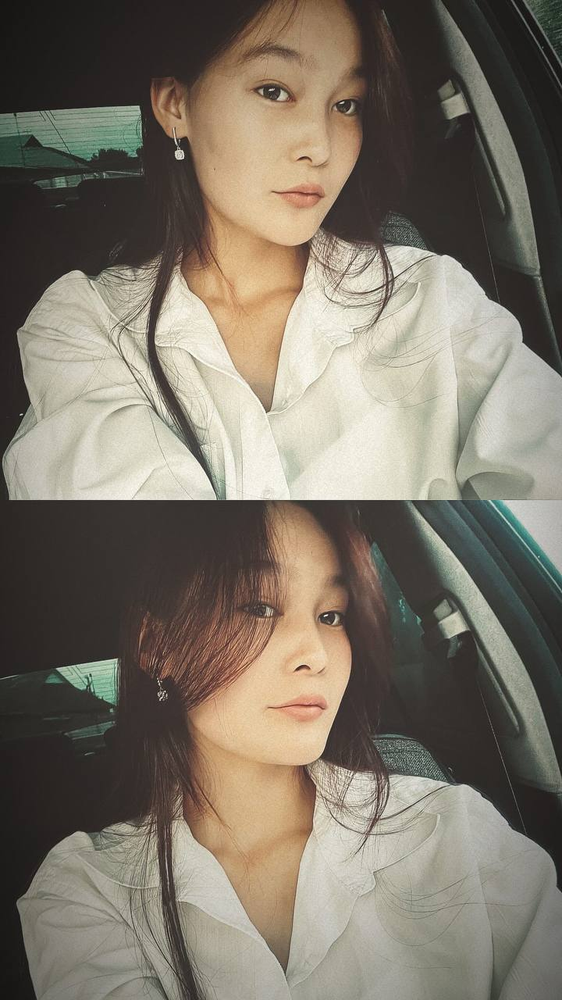
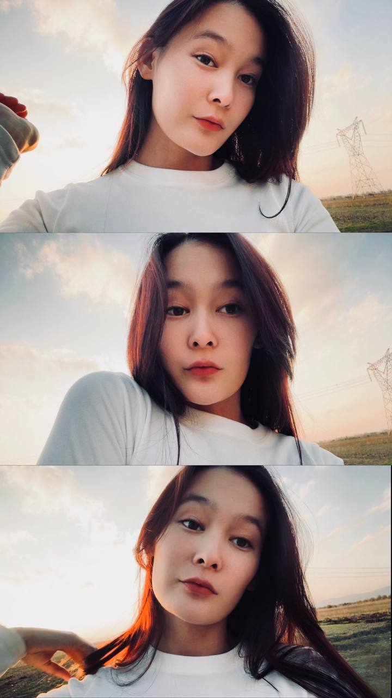

<html>
<head>
  <meta charset="utf-8">
  <meta name="viewport" content="width=device-width, initial-scale=1">
  <title></title>
 <link rel="stylesheet" type="text/css" href="foto.css">
</head>
<body>

  

    

      
    

  

  

    

      
    

  

  

    

      
    

  

  

    

      
    

  

  

    

      
    

  

  

    

      
    

  

  

    

      
    

  

  

    

      
    

  

  

    

      
    

  

  

    

      
    

  

  
High-end, full-service visual content creation for lifestyle branding.

<a href="https://www.supah.it" target="_blank" class="logo">S</a>

  <a href="https://www.linkedin.com/in/fabio-ottaviani-82b0776/" target="_blank"
    ><svg>
      <use xlink:href="#ico-linkedin"></use></svg
  ></a>
  <a href="https://www.instagram.com/supahfunk/" target="_blank"
    ><svg>
      <use xlink:href="#ico-instagram"></use></svg
  ></a>

<svg style="display: none">
  <symbol id="ico-instagram" viewBox="0 0 35 35">
    <circle opacity=".2" cx="17.5" cy="17.5" r="17" stroke="var(--fill)" fill="none"></circle>
    <path
      fill-rule="evenodd"
      clip-rule="evenodd"
      d="M24.944 20.476c.028-.457.042-1.282.042-2.476s-.014-2.019-.042-2.476c-.056-1.09-.378-1.93-.965-2.517s-1.422-.91-2.503-.965C21.018 12.014 20.194 12 19 12s-2.019.014-2.476.042c-1.081.047-1.92.368-2.517.965s-.918 1.436-.965 2.518C13.014 15.98 13 16.805 13 18c0 1.194.014 2.019.042 2.476.047 1.09.368 1.93.965 2.517s1.436.91 2.518.965c.466.028 1.29.042 2.475.042 1.184 0 2.01-.014 2.476-.042 1.072-.047 1.906-.368 2.503-.965.597-.597.918-1.436.965-2.517ZM19 13.075h-1.427c-.186 0-.438.01-.755.029a11.61 11.61 0 0 0-.797.07c-.215.028-.401.08-.56.154-.26.102-.489.251-.685.447-.196.196-.35.425-.461.685-.056.15-.103.336-.14.56a7.843 7.843 0 0 0-.084.811 7.113 7.113 0 0 0-.014.741c.01.178.01.453 0 .826-.01.373-.01.573 0 .601.01.028.01.228 0 .601s-.01.648 0 .826c.01.177.014.424.014.74 0 .318.028.588.084.812l.14.56c.112.26.265.489.461.685.196.196.425.345.685.447.15.056.336.108.56.154.224.047.49.07.797.07.308 0 .56.01.755.028.196.019.471.019.826 0 .354-.019.554-.019.601 0 .047.019.242.019.587 0s.62-.019.826 0c.205.019.456.01.755-.028.298-.037.569-.06.811-.07.242-.01.424-.06.546-.154.26-.102.494-.251.699-.447a1.75 1.75 0 0 0 .447-.686c.056-.149.103-.335.14-.559.038-.224.066-.494.084-.811.019-.317.023-.564.014-.741a11.82 11.82 0 0 1 0-.826c.01-.373.01-.573 0-.601-.01-.028-.01-.228 0-.601s.01-.648 0-.826c-.01-.177-.014-.424-.014-.74 0-.318-.028-.588-.084-.812l-.14-.56a1.956 1.956 0 0 0-1.147-1.133 3.979 3.979 0 0 0-.545-.153 3.915 3.915 0 0 0-.811-.07c-.326 0-.578-.01-.755-.028a5.916 5.916 0 0 0-.826 0c-.372.019-.568.019-.587 0Zm3.706 2.225c.14-.14.21-.308.21-.504a.57.57 0 0 0-.21-.503.767.767 0 0 0-.517-.21.718.718 0 0 0-.504.21.622.622 0 0 0-.21.503c.01.196.08.364.21.504s.299.21.504.21c.205 0 .377-.07.517-.21ZM22.063 18c0 .849-.298 1.576-.895 2.182a2.882 2.882 0 0 1-2.168.895 3.075 3.075 0 0 1-2.182-.895c-.606-.588-.904-1.315-.895-2.182.01-.867.308-1.594.895-2.182.588-.587 1.315-.886 2.182-.895.867-.01 1.59.29 2.168.895.578.606.876 1.333.895 2.182Zm-1.077 0a1.95 1.95 0 0 0-.573-1.413A1.897 1.897 0 0 0 19 16c-.56 0-1.03.196-1.413.587A2.001 2.001 0 0 0 17 18c-.01.55.186 1.021.587 1.413.401.391.872.587 1.413.587.54 0 1.012-.196 1.413-.587.4-.392.592-.863.573-1.413Z"
      transform="translate(-1.5 -0.5)"
      fill="var(--fill)"
    ></path>
  </symbol>

  <symbol id="ico-linkedin" viewBox="0 0 35 35">
    <circle opacity=".2" cx="17.5" cy="17.5" r="17" stroke="var(--fill)" fill="none"></circle>
    <path
      fill-rule="evenodd"
      clip-rule="evenodd"
      d="M15.3025 14.0835C15.3025 14.3845 15.1934 14.6403 14.9752 14.851C14.757 15.0617 14.4786 15.167 14.14 15.167C13.8014 15.167 13.5267 15.0617 13.316 14.851C13.1053 14.6403 13 14.3807 13 14.0722C13 13.7637 13.1053 13.5079 13.316 13.3047C13.5267 13.1016 13.8051 13 14.1512 13C14.4974 13 14.772 13.1016 14.9752 13.3047C15.1783 13.5079 15.2874 13.7675 15.3025 14.0835ZM13.0677 23V16.0248H15.2348V23H13.0677ZM16.4763 16.0248C16.5064 16.8676 16.5214 17.6125 16.5214 18.2596V23H18.7111V18.9819C18.7111 18.7111 18.7336 18.5305 18.7788 18.4402C18.9895 17.8984 19.3582 17.6275 19.8849 17.6275C20.6223 17.6275 20.991 18.1317 20.991 19.14V23H23.158V18.8691C23.158 17.8758 22.9285 17.1272 22.4695 16.623C22.0105 16.1189 21.4048 15.8668 20.6524 15.8668C19.6742 15.8668 18.9594 16.243 18.5079 16.9955H18.4628L18.3499 16.0248H16.4763Z"
      transform="translate(0 -1)"
      fill="var(--fill)"
    ></path>
  </symbol>
</svg>

  
</body>
</html>

<html lang="en">
  <head>
    <meta charset="UTF-8" />
    <meta name="viewport" content="width=device-width,user-scalable=no" />
    <title>3D Carousel</title>
    
  </head>
  <body>
    

      

        <!-- Add your images (or video) here -->
        
        
        
        
        
        
        <!-- Example image with link -->
        
        <!-- Example add video  -->
        <video controls autoplay="autoplay" loop>
          <source
            src="video_2024-11-12_17-59-08.mp4"
            type="video/mp4"
          />
        </video>
        <!-- Text at center of ground -->
        
Tynybekova Asema

      

      

    

    

      <audio></audio>
    

    <!-- github corner (https://github.com/tholman/github-corners) -->
    <a href="https://github.com/HoangTran0410/3DCarousel" target="_blank" class="github-corner" aria-label="View source on GitHub"><svg width="80" height="80" viewBox="0 0 250 250" style="fill:#fff; color:#000; position: absolute; top: 0; border: 0; right: 0;" aria-hidden="true"><path d="M0,0 L115,115 L130,115 L142,142 L250,250 L250,0 Z"></path><path d="M128.3,109.0 C113.8,99.7 119.0,89.6 119.0,89.6 C122.0,82.7 120.5,78.6 120.5,78.6 C119.2,72.0 123.4,76.3 123.4,76.3 C127.3,80.9 125.5,87.3 125.5,87.3 C122.9,97.6 130.6,101.9 134.4,103.2" fill="currentColor" style="transform-origin: 130px 106px;" class="octo-arm"></path><path d="M115.0,115.0 C114.9,115.1 118.7,116.5 119.8,115.4 L133.7,101.6 C136.9,99.2 139.9,98.4 142.2,98.6 C133.8,88.0 127.5,74.4 143.8,58.0 C148.5,53.4 154.0,51.2 159.7,51.0 C160.3,49.4 163.2,43.6 171.4,40.1 C171.4,40.1 176.1,42.5 178.8,56.2 C183.1,58.6 187.2,61.8 190.9,65.4 C194.5,69.0 197.7,73.2 200.1,77.6 C213.8,80.2 216.3,84.9 216.3,84.9 C212.7,93.1 206.9,96.0 205.4,96.6 C205.1,102.4 203.0,107.8 198.3,112.5 C181.9,128.9 168.3,122.5 157.7,114.1 C157.9,116.9 156.7,120.9 152.7,124.9 L141.0,136.5 C139.8,137.7 141.6,141.9 141.8,141.8 Z" fill="currentColor" class="octo-body"></path></svg></a>
    
  </body>
</html>
